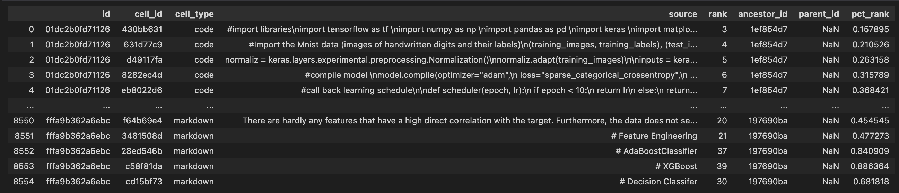

# Google AI4Code – Understand Code in Python Notebooks

## Introduction
The goal of this competition is to understand the relationship between code and comments in Python notebooks. You are challenged to reconstruct the order of markdown cells in a given notebook based on the order of the code cells, demonstrating comprehension of which natural language references which code.

## Data Description
The data is provided in the form of a JSON file, where each line is a JSON object representing a notebook. The JSON object contains the following fields:
* id: the unique identifier of the notebook
* cell_id: the unique identifier of the cell
* cell_type: the type of the cell, either “code” or “markdown”
* source: the content of the cell
* rank: the rank of the cell, where the first cell has rank 0, the second cell has rank 1, and so on
* pct_ranks: the percentile rank of the cell, where the first cell has percentile rank 0, the second cell has percentile rank 1/number of cells, and so on
Here is an img of the data:


## Data Preprocessing solution
There are total two pairs to deal with the datasets: Pointwise, Pairwise. For the Pointwise, the overview of the solution is as follows: we sample up to 20 code cells as the global context, then the input will look like this:
```<s> Markdown content <s> code content1 <s> code content2 <s> ... <s> code content20 <s>```

Then we use the BERT to encode the features input, and use the last hidden state of the [CLS] token as the representation of the input.

## Reproduce the Solution
### Requirements
* Python >=3 
* Pytorch >=1.0
* Transformers 

### Preprocess
```python preprocess.py``` to preprocess the data

The output will be saved in the ```./data``` folder

### Training

```python train.py --md_max_len 64 --total_max_len 512 --batch_size 8 --accumulation_steps 4 --epochs 5 --n_workers 8``` 

